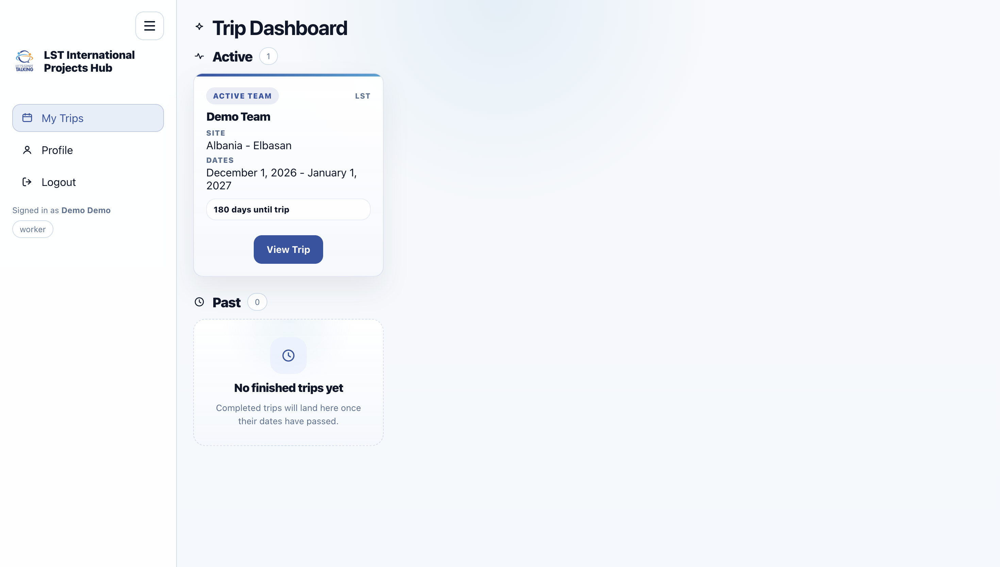
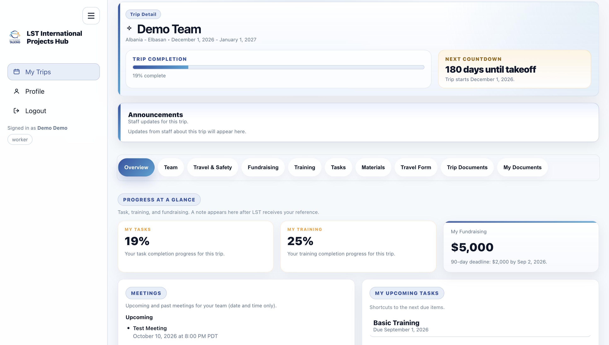
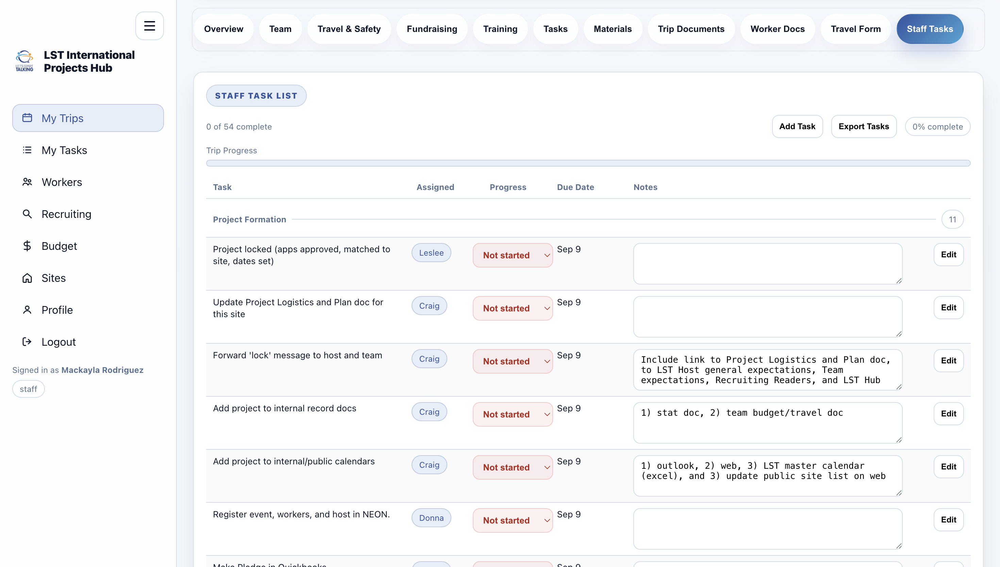
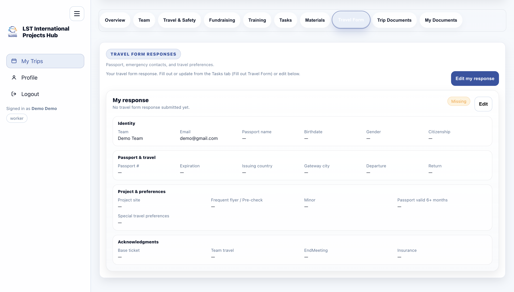

# 🌍 LST Team Hub

LST Team Hub is a centralized web application designed to support team coordination, communication, and resource sharing for mission teams. The platform helps streamline organization, improve accessibility of information, and enhance collaboration across team members.

## Demo

**[Watch the demo video →](https://www.loom.com/share/00f3d6ef36c446ea9326f3fc534437f9)** · ~3 min walkthrough (Next.js + Supabase)

## Screenshots

| My Trips | Trip overview |
| :---: | :---: |
|  |  |

| Staff tasks | Travel form |
| :---: | :---: |
|  |  |

Add PNG or JPG files to [`docs/screenshots/`](docs/screenshots/) using the names above (or update the paths here).

---

## 🚀 Features

- 📋 Centralized team information and resources  
- 🗂️ Organized access to important documents and links  
- 📅 Event and schedule coordination  
- 👥 Team communication support  
- 🔐 Structured and user-friendly interface  

---

## 🛠️ Tech Stack

- Frontend: HTML, CSS, JavaScript  
- Backend: Supabase  
- Database: Supabase
- Tools: Git, GitHub  

---

## 🎯 Purpose

The goal of LST Team Hub is to create an efficient and user-friendly system that allows teams to easily access important information, stay organized, and collaborate effectively. This project focuses on improving workflow and reducing miscommunication within team environments.

---

## 💡 Key Learnings

- Improved front-end development skills  
- Strengthened problem-solving and debugging abilities  
- Gained experience designing user-focused interfaces  
- Learned how to structure and organize a full application  

---

## 📌 Future Improvements

- Add user authentication and login system  
- Improve UI/UX design  
- Integrate real-time communication features  
- Expand mobile responsiveness  

---

## 🔑 Demo account

Try the live app at **[lst-team-hub.vercel.app/login](https://lst-team-hub.vercel.app/login)** with this demo account:

| | |
|---|---|
| **Login** | [https://lst-team-hub.vercel.app/login](https://lst-team-hub.vercel.app/login) |
| **Email** | `demo@gmail.com` |
| **Password** | `Demo1234` |

---

## 👩🏽‍💻 Author

**Mackayla Rodriguez**  
